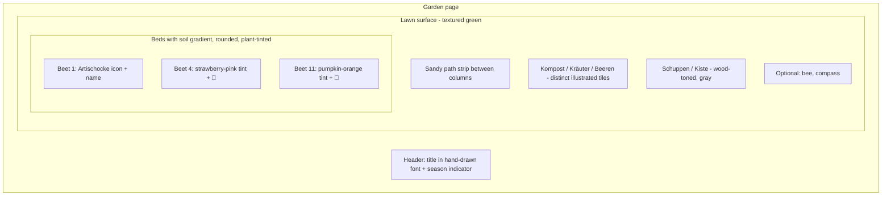

# Plan: Make the Garden Look Like a Beautiful Garden 🌱

A plan to evolve the current rectangular grid into something that *feels* like a real, living garden — without losing the clarity of the layout or the domain model.

---

## 1. Diagnosis — what feels "flat" today

Looking at the current screenshot and the code in [`GardenLayout.tsx`](src/components/GardenLayout.tsx:19), [`PatchTile.tsx`](src/components/PatchTile.tsx:25), and [`tailwind.config.js`](tailwind.config.js:29):

- **All beds look identical.** Every patch is a plain sandy rectangle. Nothing tells you that beet 11 has a sprawling pumpkin while beet 4 has neat strawberries.
- **The lawn between beds is one flat color.** No texture, no path, no border — the green just stops at the page edge.
- **Plant names are pure text.** A garden plan made of words feels like a spreadsheet, not a garden.
- **Special tiles (Kompost, Kräuter, Beeren, Schuppen, Kiste) already hint at variants** — that idea is good but underused.
- **Hierarchy is missing.** Empty beds (Beet 12), the herb spiral, and the compost all read at the same visual weight.
- **Borders are hard, square, and uniform.** Real garden beds have soil that crumbles at the edge, paths between them, sometimes a wooden frame.

---

## 2. Design direction

A **stylized, illustrated top-down garden** — still readable as a plan, but with enough warmth, texture, and color variation that it feels alive. Think: a hand-drawn garden journal page, not a CAD drawing.

Three guiding principles:

1. **Soil, paths, lawn — three distinct surfaces.** The eye should immediately read "these are beds, this is grass, this is a path."
2. **Each bed gets a personality from what grows in it.** A bed of strawberries should feel different from a bed of potatoes, even at a glance.
3. **Subtle motion & life.** Gentle hover/tap feedback, soft shadows, maybe a few quiet decorative touches (butterflies, bees, watering can icon) — used sparingly.

---

## 3. Concrete ideas (ordered roughly low-effort → high-effort)

### A. Backdrop & surfaces — the "ground"

- **Lawn texture.** Replace the flat `#d4e6c3` with a very subtle SVG/CSS pattern: tiny grass tufts, dotted noise, or a soft radial gradient to give depth. Keeps performance trivial.
- **Sandy path running between left column and middle beds.** The `garden.path` color (`#c8b99a`) is already defined in [`tailwind.config.js`](tailwind.config.js:33) but never used. Render it as a narrow vertical strip in the grid gutter — instant "this is a real garden."
- **Subtle outer frame** — a darker green hedge-like border around the whole layout, or a wooden plank texture, to anchor the page.

### B. Beds — the "personality"

- **Soil gradient instead of flat sand.** Each `default` patch gets a soft radial or linear gradient (lighter in the middle, darker at the edges) to suggest mounded soil.
- **Inner inset shadow** so beds look slightly *recessed* into the lawn, like real raised/dug beds.
- **Rounded corners (lg or xl).** Real beds aren't perfect rectangles. A small radius softens everything immediately.
- **Plant-driven accent color.** Each bed picks up a faint tint from its dominant plant (strawberry-pink for Beet 4, pumpkin-orange for Beet 11, leafy-green for kale beds). Implementation: extend the plant domain with a `family` or `accentColor`, derive the bed's tint from the first plant in `bedding`.
- **Plant icons next to names.** Small inline SVG icons (🍓 🎃 🥬 🌶 🌽) — either emoji for zero effort, or a curated set in [`public/icons.svg`](public/icons.svg) (which already exists!). Names + icon read much faster than names alone.
- **Empty bed state.** Beet 12 currently looks "broken." Style empty beds as freshly-tilled soil: darker, with a dashed border and a faint "leer" or "+ pflanzen" hint.

### C. Special tiles — lean into the variants

- **Kompost** already dark — add a tiny steaming-pile illustration or a subtle brown texture so it reads as compost, not just a black box.
- **Kräuter (herb spiral).** The dashed circle is charming. Push it further: concentric dashed rings, tiny herb sprig icon in the middle.
- **Beeren** — change from generic purple to **raspberry/himbeer pink** (already noted in [`PROJECT.md`](PROJECT.md:17)). Add a berry-cluster icon.
- **Schuppen & Kiste** — make these **gray/wood-toned** (also in [`PROJECT.md`](PROJECT.md:17)), distinct from the warm soil of the beds. A faint wood-grain pattern would sell it.

### D. Typography & hierarchy

- **Hand-drawn / friendly display font** for headings and bed numbers (e.g. *Caveat*, *Patrick Hand*, *Kalam* from Google Fonts). Keep the body in the current sans for readability.
- **Bed number badge** — currently a tiny gray "11" in the corner. Turn it into a small filled circle/tag (like a garden marker stake) — more charming, easier to scan.
- **Plant names slightly larger and looser.** Current `text-sm` (10px) is cramped. With icons next to them, names can stay short.

### E. Micro-interactions

- **Hover/tap:** instead of just `shadow-md`, a gentle lift + slight scale (`hover:-translate-y-0.5 hover:scale-[1.02]`) — feels tactile.
- **Tap feedback on mobile:** brief background pulse.
- **Page enter animation:** beds fade/slide in with a small stagger — feels like the garden "growing in" on first load. One-shot, no library needed.

### F. Decorative touches (use sparingly!)

- A **compass rose** in an empty corner.
- A **bee or butterfly** SVG positioned absolutely over the lawn. Optional gentle CSS-keyframe drift.
- A **sun icon** in the top corner that subtly indicates the season (could later tie into the Tagebuch idea from [`PROJECT.md`](PROJECT.md:9)).

---

## 4. Visual concept

---

## 5. Suggested implementation order

A pragmatic order — each step is shippable on its own and visibly improves the page.

1. **Color & surface pass** (Tailwind config + CSS): lawn texture, sandy path strip, fix Beeren to raspberry, gray Schuppen/Kiste, soft soil gradient on default beds, rounded corners.
2. **Empty-bed style** for Beet 12.
3. **Bed-number badge redesign** (small marker-stake look).
4. **Plant icons** next to names — start with the 5–10 most visible plants. Reuse [`public/icons.svg`](public/icons.svg) sprite or emoji as a fast first pass.
5. **Plant accent tints** — extend the plant domain with an optional `accentColor` / `family`, derive bed tint from the first plant.
6. **Typography**: import a hand-drawn display font, apply to headings + bed numbers.
7. **Micro-interactions**: hover lift, mount stagger.
8. **Decorative touches**: bee/butterfly, compass — only if the page still feels calm.

---

## 6. Domain impact (DDD note)

Most of this is presentation-only and lives in [`PatchTile.tsx`](src/components/PatchTile.tsx), [`StorageUnitTile.tsx`](src/components/StorageUnitTile.tsx), [`GardenLayout.tsx`](src/components/GardenLayout.tsx), [`tailwind.config.js`](tailwind.config.js), and [`index.css`](src/index.css).

The one **domain-touching** change is step 5 (plant accent color / family). That's a meaningful addition to the `Plant` type in [`types.ts`](src/domain/types.ts) — it expresses a real domain concept (plant family / visual identity), not just styling. Worth a small follow-up to define a `PlantFamily` enum or `accentColor` field with a sensible default, and update [`plants.ts`](src/domain/plants.ts) accordingly. Tests in [`App.test.tsx`](src/App.test.tsx) for behavior should stay green; only add new tests if the tinting logic itself becomes branching behavior worth pinning.

---

## 7. Open questions for you

- How **playful** vs. **clean** do you want it? (Hand-drawn journal page ↔ minimalist Notion-style)
- Are **emoji icons** OK as a v1, or should we go straight to a curated SVG icon set?
- Should the lawn / path be **purely decorative**, or also help layout (e.g. visually grouping beds 1–11 as "the long row")?
- Any plants where you already know the "right" color in your head? (e.g. Kürbis = orange, Erdbeeren = pink, Tomaten = red)
